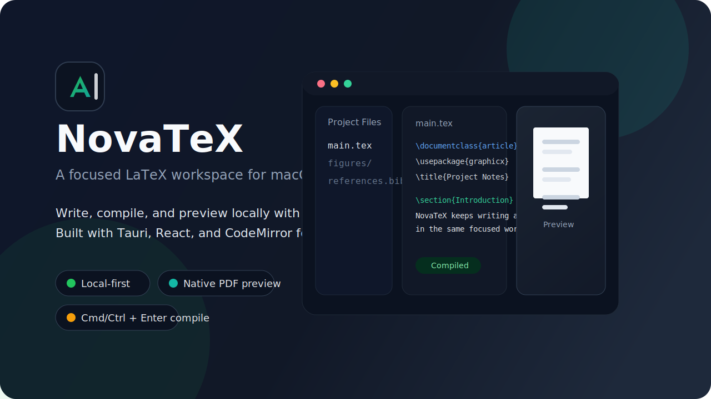
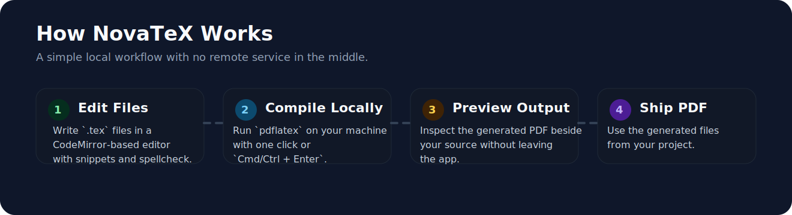

<p align="center">
  
</p>

<p align="center">
  <a href="https://github.com/Ajshadbolt/NovaTEX/releases/latest"></a>
  
  
  <a href="./LICENSE"></a>
</p>

<p align="center">
  A clean, local-first LaTeX editor for macOS with native-feeling performance, side-by-side PDF preview, and fast project workflows.
</p>

## Overview

NovaTeX is a desktop LaTeX workspace built for writing and compiling locally. It combines a CodeMirror editor, project file browser, and integrated PDF preview in a focused two-pane layout so you can stay in one place while drafting documents.

The project is designed around straightforward trust signals:

- Your files stay in normal local folders.
- Compilation runs on your machine with `pdflatex`.
- The app is built with a small, inspectable Tauri + React codebase.
- The repository is MIT-licensed.

## Visuals

### Editor Experience

<p align="center">
  
</p>

## Why NovaTeX

- Side-by-side writing and PDF preview for a tighter edit/compile loop
- Local compilation with `pdflatex`, without requiring a remote service
- File tree for working with real project folders instead of hidden app state
- Built-in LaTeX snippets for common structures like figures, tables, and sections
- Inline spellcheck support for a cleaner drafting experience
- Keyboard-friendly compile flow with `Cmd/Ctrl + Enter`

## Install

### Download the macOS app

Get the latest DMG from GitHub Releases:

- [Download NovaTeX](https://github.com/Ajshadbolt/NovaTEX/releases/latest)

Install steps:

1. Open the DMG.
2. Drag `NovaTeX.app` into `Applications`.
3. Launch the app.

If macOS warns that the app is unsigned, right-click `NovaTeX.app`, choose **Open**, and confirm once.

## What You Need

NovaTeX is currently intended for macOS and expects a local LaTeX toolchain.

- macOS
- A LaTeX distribution with `pdflatex` available on your `PATH`
- `MacTeX` or `BasicTeX` is sufficient for most setups

## Build From Source

### Prerequisites

- Node.js 20+
- Rust toolchain
- A working LaTeX installation with `pdflatex`

### Development

```bash
npm install
npm run tauri dev
```

### Production build

```bash
npm run tauri build
```

Generated outputs include:

- `dist/`
- `src-tauri/target/release/bundle/macos/NovaTeX.app`
- `src-tauri/target/release/bundle/dmg/NovaTeX_0.1.0_aarch64.dmg`

## Tech Stack

- Tauri 2 for the desktop shell
- React 19 for the UI
- CodeMirror 6 for editing
- PDF.js for in-app PDF rendering
- Rust for native command integration

## Project Status

NovaTeX already supports the core editing workflow:

- Open an existing LaTeX project folder
- Create a new project with a starter `main.tex`
- Edit project files
- Compile `main.tex`
- Preview the generated `main.pdf`

If you want a lightweight local LaTeX app rather than a cloud editor, this repository is aimed at that use case.

## License

This project is licensed under the MIT License. See [LICENSE](./LICENSE).
